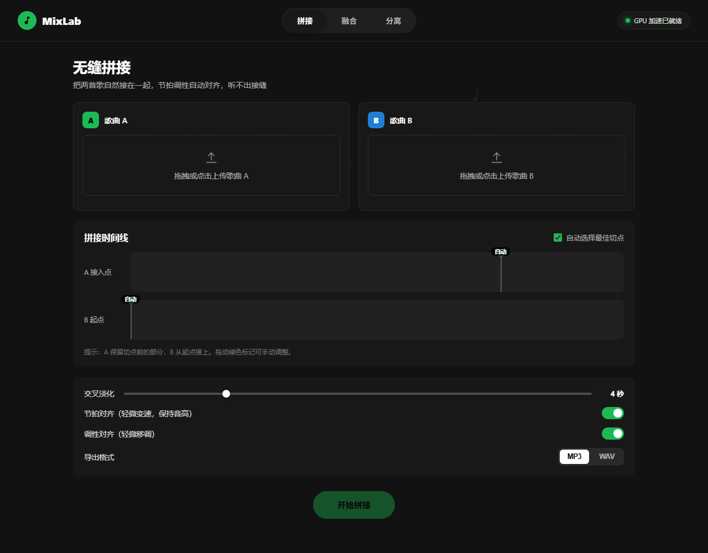
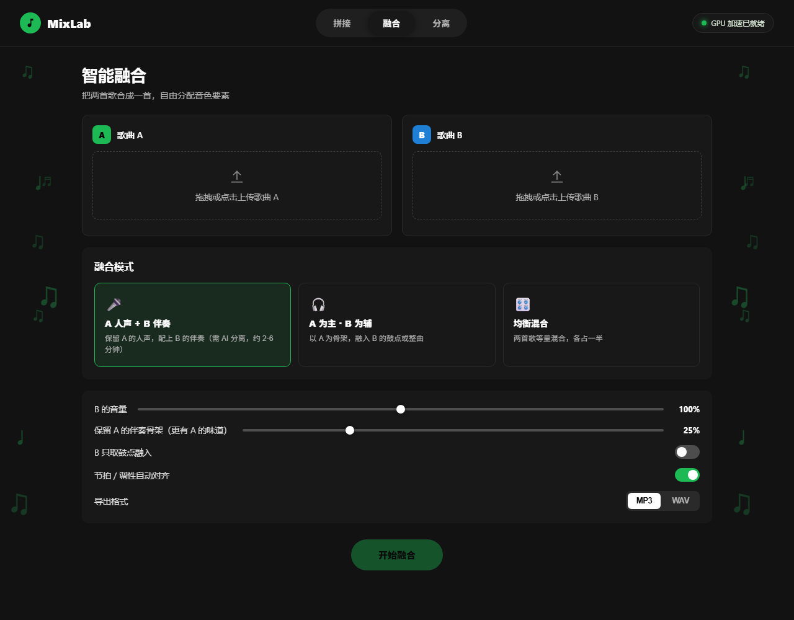
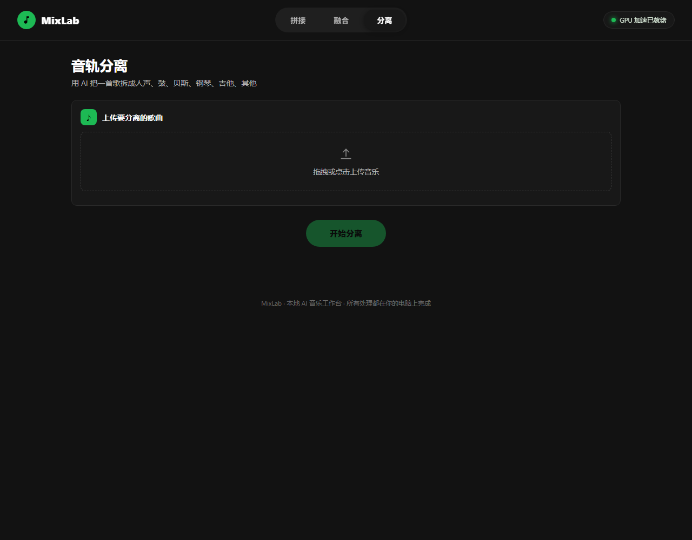

# 🎧 MixLab · 音乐融合工坊 / Music Mixing Studio

> **你的私人 AI 音乐实验室 · Your personal AI music lab**
>
> 把两首歌揉成一首，把一首歌拆成六块。
> Merge two songs into one. Split one song into six.
> 从此 BGM 自由，vlog 不愁。 🎬


---

## 🚀 这是什么？ / What is this?

**中文**：MixLab 是一个跑在你电脑上的 AI 音乐工作台。它不联网、不传歌、不收费，
所有魔法都在你的显卡里发生。上传你的歌，然后：把两首歌**无缝接在一起**、
把两首歌**融合成一首新歌**、或者把一首歌**拆成人声和乐器**。全部一键完成。

**English**：MixLab is an AI music workstation that runs entirely on your own
computer. No cloud, no uploads, no fees — just local GPU magic. Drop in your
tracks, then seamlessly **join** two songs, **fuse** them into a brand-new one,
or **split** a song into vocals and instruments. All in one click.

---

## 🎯 给谁用？ / Who is it for?

- 🎬 **B 站 / 抖音 / YouTube 创作者**：不想用烂大街的 BGM？自己造一个独一无二的。
- 📹 **Vlog 爱好者**：两首歌拼成一段自然衔接的配乐，情绪不断档。
- 🎤 **翻唱玩家**：一键抠出伴奏，或者把任意伴奏和你的清唱合在一起。
- 🎧 **音乐爱好者**：好奇"这首的前奏 + 那首的副歌"会是什么样？试试就知道。
- 🧑‍💻 **懒人**：不想学专业 DAW，只想点一个按钮出成品。

---

## ✨ 功能 / Features

### 🧩 无缝拼接 / Seamless Join

> "这首歌的前奏，接那首歌的副歌，听起来要像一首歌。"

上传两首歌，在可视化时间线上拖拽切点，AI 自动对齐节拍和调性，用交叉淡化
把两段音乐焊在一起——**听不出接缝**，就像它们本来就是一首歌。
还可以一键 **🎯 智能识别结构**：自动找到 A 的前奏结束点和 B 的副歌开始点，
切点完全不用手动拖。



### 🎛️ 智能融合 / Smart Fusion

> "A 的人声 + B 的伴奏 = ？？？"

五种融合模式任你选：**A 人声 + B 伴奏**、**A 为主 B 为辅**、**均衡混合**、
**🎤🎵 和声叠加**（B 的人声自动转成和声垫在 A 主唱下）、
**🥁⇄ 节奏互换**（A 的旋律 + B 的鼓和贝斯）。
AI 先把两首歌拆开，再按你的想法重新组装。B 音量、A 的骨架比例都能调，
想要"A 的味道 + B 的灵魂"完全由你决定。还有 **🎚️ 音色统一** 开关：
自动匹配混响、频段和立体声宽度，让融合结果听起来更像原生录音。



### 🪓 音轨分离 / Stem Separation

> "这首歌的钢琴真好听，能只留下钢琴吗？"

一首歌拆成 **6 个音轨**：人声、鼓、贝斯、吉他、钢琴、其他（含弦乐）。
每个音轨都能独立试听、单独下载，也可以打包 ZIP 一次带走。
（诚实说明：开源模型最细只能到 6 轨，弦乐暂时和"其他"住在一起 🏠）



---

## 🚀 快速开始 / Quick Start

```bash
# 1. 双击 MixLab.exe（Windows，推荐，真正的程序）
#    或双击 启动工具.bat / 桌面快捷方式
#    停止服务：双击 停止MixLab.bat
#    或者命令行启动：
cd music-mixer
.venv\Scripts\python.exe -m uvicorn backend.app:app --host 127.0.0.1 --port 8000

# 2. 浏览器打开 http://localhost:8000
# 3. 上传歌曲，选功能，点按钮，拿成品
```

要求：Windows + NVIDIA 显卡（有 CUDA）体验最佳；纯 CPU 也能跑，就是分离会慢一些。

---

## 🛠️ 技术栈 / Tech Stack

| 层 | 技术 |
| --- | --- |
| 后端 | Python · FastAPI · Demucs 4.1 (htdemucs_6s) · librosa · ffmpeg |
| 前端 | 原生 HTML / CSS / JS · Spotify 风格深色 UI |
| AI 分离 | htdemucs_6s 六轨模型（55MB，离线可用） |
| 硬件 | NVIDIA 3060 实测：24 秒音频分离约 10 秒 |

---

## 🗺️ 后续计划 / Roadmap

这个项目会一直更新 🔥，目前已经排上队的：

- [ ] 🎯 **智能结构识别**：自动找到前奏/副歌，切点不用手动拖
- [ ] 🎚️ **音色统一**：混响和空间匹配，融合得更像原生
- [ ] 🎹 **更多融合玩法**：和声叠加、节奏互换
- [ ] 📦 **批量处理**：整个歌单一次搞定
- [ ] 🎬 **视频直出**：导入视频，输出带 BGM 的成品
- [ ] 🧠 **更多分离模型**：UVR / MDX 等模型可选，音质再进一步
- [ ] 🌍 **多语言界面**：不只是 README 双语

有想法？欢迎提 issue 或直接告诉我，说不定下一个版本就有你的点子。

---

## ⚠️ 版权提醒 / Copyright Notice

工具用于个人学习与创作。从平台下载的音乐用于二创时，请遵守平台版权规则；
分离出的素材请勿公开传播。好歌值得被尊重，创意也是。🙏

---

## 💬 关于 / About

Made with 🎵 by a vlog creator who wanted better BGM.

本地优先 · 隐私优先 · 好玩优先。

---

# 🇬🇧 English Version

## What is this?

MixLab is a local-first AI music workstation for creators who want better
background music without learning a professional DAW. Everything runs on your
own machine — your tracks never leave your computer.

## Features

1. **Seamless Join** — splice two songs together with beat & key alignment and a
   smooth crossfade. Drag the cut points on a visual timeline; the result sounds
   like one continuous track.
2. **Smart Fusion** — combine two songs into a new one. Three modes: A's vocals +
   B's accompaniment, A as the main body with B as flavor, or a balanced blend.
   Tune B's volume and how much of A's backbone to keep.
3. **Stem Separation** — split one song into six stems: vocals, drums, bass,
   guitar, piano, and other (including strings). Preview, download individually,
   or grab everything as a ZIP.

## Who is it for?

Video creators, vloggers, cover singers, mashup explorers, and anyone who has
ever thought: *"this song's intro would sound amazing with that song's chorus."*

## Quick start

Run the server (see the Chinese section above), open `http://localhost:8000`,
upload your tracks, pick a page, and press the green button. That's it.

## Roadmap

This project is actively maintained and will keep evolving:

- Smarter song-structure detection for automatic cut points
- Reverb/space matching for more natural fusions
- More fusion recipes (harmony stacking, rhythm swapping)
- Batch processing for whole playlists
- Video-in / scored-video-out
- More separation models (UVR / MDX) for even better quality

## Copyright

Use it for personal learning and creation. Respect the copyright rules of the
platforms you get your music from, and don't redistribute separated stems.

---

⭐ If this project is useful to you, leave a star — it powers the developer. ⚡
